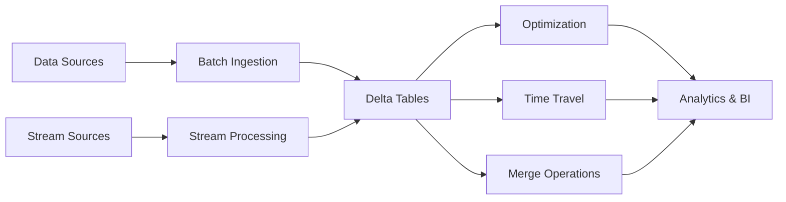

# Open Tables with Delta Lake


An end-to-end solution for building modern data pipelines with Open Tables and Delta Lake. This project demonstrates core Delta Lake functionality for reliable data management.


## Features

### Core Operations
- **Create Delta Tables**: Initialize new Delta tables with schema enforcement
- **Batch Data Ingestion**: Efficiently append/replace data in batches
- **Streaming Ingestion**: Real-time data processing with ACID guarantees
- **Schema Evolution**: Safely modify table schemas over time
- **Time Travel**: Query historical data versions with versioning

### Advanced Functions
- **Upsert/Merge**: Combine insert, update, and delete operations (CDC)
- **Optimize**: Compact small files with bin-packing and Z-Ordering
- **Vacuum**: Remove old files with retention period control
- **Change Data Feed**: Track row-level changes between versions
- **Generated Columns**: Automatically compute column values

### Data Quality & Governance
- **Data Validation**: Enforce constraints and data quality rules
- **Table Constraints**: Apply NOT NULL and CHECK constraints
- **Column Mapping**: Handle schema changes without rewriting data
- **Audit Logging**: Track all data modifications

## Getting Started

### Prerequisites
- Apache Spark 3.2+
- Delta Lake 2.0+
- Storage system (S3, ADLS, HDFS, etc.)

### Installation
Add to your Spark session:
```python
from pyspark.sql import SparkSession

spark = SparkSession.builder \
    .appName("DeltaLakeDemo") \
    .config("spark.sql.extensions", "io.delta.sql.DeltaSparkSessionExtension") \
    .config("spark.sql.catalog.spark_catalog", "org.apache.spark.sql.delta.catalog.DeltaCatalog") \
    .getOrCreate()
```

## Usage Examples

### Create Delta Table
```python
# Schema definition and table creation
```

### Ingest Data
```python
# Batch append and streaming write examples
```

### Time Travel
```python
# Query previous table versions
```

### Schema Evolution
```python
# Add new columns safely
```

### Merge Operation
```python
# Upsert pattern with CDC
```

### Optimize & Z-Order
```python
# File compaction and column clustering
```

## Architecture



## Contributing
1. Fork the repository
2. Create your feature branch (`git checkout -b feature/improvement`)
3. Commit your changes (`git commit -am 'Add new feature'`)
4. Push to the branch (`git push origin feature/improvement`)
5. Open a pull request

## License
Distributed under the Apache License 2.0. See `LICENSE` for more information.

---
[Delta Lake Documentation](https://delta.io/) | [Spark SQL Reference](https://spark.apache.org/docs/latest/sql-ref.html)
